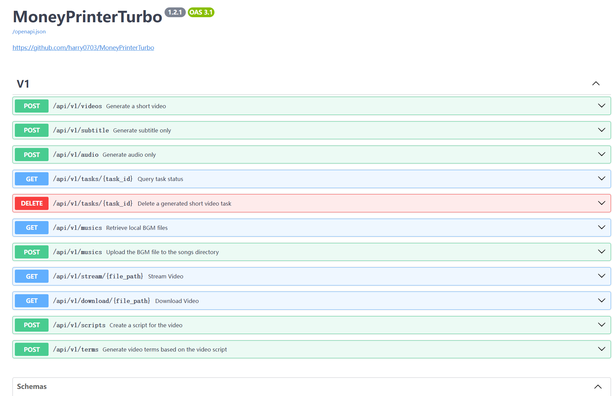

<div align="center">
<h1 align="center">MoneyPrinterTurbo 💸</h1>

<p align="center">
  <a href="https://github.com/terryuuang/MoneyPrinterTurbo/stargazers"></a>
  <a href="https://github.com/terryuuang/MoneyPrinterTurbo/issues"></a>
  <a href="https://github.com/terryuuang/MoneyPrinterTurbo/network/members"></a>
  <a href="https://github.com/terryuuang/MoneyPrinterTurbo/blob/main/LICENSE"></a>
</p>

<h3>📢 關於此專案</h3>
<p>本專案基於 <a href="https://github.com/harry0703/MoneyPrinterTurbo">harry0703/MoneyPrinterTurbo</a> 進行 Fork 開發</p>
<p><strong>主要改進：</strong></p>
<ul style="text-align: left; display: inline-block;">
  <li>🌏 <strong>完整繁體中文化</strong> - 介面與文件全面繁體中文化</li>
  <li>🔧 <strong>問題修正</strong> - 修復原版本中的已知問題</li>
  <li>✨ <strong>功能優化</strong> - 針對繁體中文使用者體驗進行優化</li>
</ul>
<br>

<h3>繁體中文 | <a href="README-en.md">English</a></h3>
<div align="center">
  <a href="https://trendshift.io/repositories/8731" target="_blank"></a>
</div>
<br>
只需提供一個影片 <b>主題</b> 或 <b>關鍵字</b> ，就可以全自動產生影片文案、影片素材、影片字幕、影片背景音樂，然後合成一個高畫質的短影片。
<br>

<h4>Web介面</h4>


<h4>API介面</h4>



</div>


## 功能特性 🎯

- [x] **繁體中文優化版本** - 基於原專案進行繁體中文化並修復相關問題
- [x] 完整的 **MVC架構**，程式碼 **結構清晰**，易於維護，支援 `API` 和 `Web介面`
- [x] 支援影片文案 **AI自動產生**，也可以**自訂文案**
- [x] 支援多種 **高畫質影片** 尺寸
    - [x] 直式 9:16，`1080x1920`
    - [x] 橫式 16:9，`1920x1080`
- [x] 支援 **批次影片產生**，可以一次產生多個影片，然後選擇一個最滿意的
- [x] 支援 **影片片段時長** 設定，方便調節素材切換頻率
- [x] 支援 **中文** 和 **英文** 影片文案
- [x] 支援 **多種語音** 合成，可 **即時試聽** 效果
- [x] 支援 **字幕產生**，可以調整 `字型`、`位置`、`顏色`、`大小`，同時支援`字幕描邊`設定
- [x] 支援 **背景音樂**，隨機或者指定音樂檔案，可設定`背景音樂音量`
- [x] 影片素材來源 **高畫質**，而且 **無版權**，也可以使用自己的 **本機素材**
- [x] 支援 **OpenAI**、**Moonshot**、**Azure**、**gpt4free**、**one-api**、**通義千問**、**Google Gemini**、**Ollama**、**DeepSeek**、 **文心一言**, **Pollinations** 等多種模型接入
    - 中國使用者建議使用 **DeepSeek** 或 **Moonshot** 作為大模型提供商（國內可直接存取，不需要VPN。註冊就送額度，基本夠用）


### 後期計畫 📅

- [ ] GPT-SoVITS 配音支援
- [ ] 最佳化語音合成，利用大模型，使其合成的聲音，更加自然，情緒更加豐富
- [ ] 增加影片轉場效果，使其看起來更加的流暢
- [ ] 增加更多影片素材來源，最佳化影片素材和文案的匹配度
- [ ] 增加影片長度選項：短、中、長
- [ ] 支援更多的語音合成服務商，比如 OpenAI TTS
- [ ] 自動上傳到YouTube平台

## 影片示範 📺

### 直式 9:16

<table>
<thead>
<tr>
<th align="center"><g-emoji class="g-emoji" alias="arrow_forward">▶️</g-emoji> 《如何增加生活的樂趣》</th>
<th align="center"><g-emoji class="g-emoji" alias="arrow_forward">▶️</g-emoji> 《金錢的作用》<br>更真實的合成聲音</th>
<th align="center"><g-emoji class="g-emoji" alias="arrow_forward">▶️</g-emoji> 《生命的意義是什麼》</th>
</tr>
</thead>
<tbody>
<tr>
<td align="center"><video src="https://github.com/terryuuang/MoneyPrinterTurbo/assets/4928832/a84d33d5-27a2-4aba-8fd0-9fb2bd91c6a6"></video></td>
<td align="center"><video src="https://github.com/terryuuang/MoneyPrinterTurbo/assets/4928832/af2f3b0b-002e-49fe-b161-18ba91c055e8"></video></td>
<td align="center"><video src="https://github.com/terryuuang/MoneyPrinterTurbo/assets/4928832/112c9564-d52b-4472-99ad-970b75f66476"></video></td>
</tr>
</tbody>
</table>

### 橫式 16:9

<table>
<thead>
<tr>
<th align="center"><g-emoji class="g-emoji" alias="arrow_forward">▶️</g-emoji>《生命的意義是什麼》</th>
<th align="center"><g-emoji class="g-emoji" alias="arrow_forward">▶️</g-emoji>《為什麼要運動》</th>
</tr>
</thead>
<tbody>
<tr>
<td align="center"><video src="https://github.com/terryuuang/MoneyPrinterTurbo/assets/4928832/346ebb15-c55f-47a9-a653-114f08bb8073"></video></td>
<td align="center"><video src="https://github.com/terryuuang/MoneyPrinterTurbo/assets/4928832/271f2fae-8283-44a0-8aa0-0ed8f9a6fa87"></video></td>
</tr>
</tbody>
</table>

## 配置要求 📦

- 建議最低 CPU **4核** 或以上，記憶體 **4G** 或以上，顯卡非必須
- Windows 10 或 MacOS 11.0 以上系統


## 快速開始 🚀

### 在 Google Colab 中執行
免去本機環境配置，點擊直接在 Google Colab 中快速體驗 MoneyPrinterTurbo

[](https://colab.research.google.com/github/terryuuang/MoneyPrinterTurbo/blob/main/docs/MoneyPrinterTurbo.ipynb)


### Windows一鍵啟動包

下載一鍵啟動包，解壓縮直接使用（路徑不要有 **中文**、**特殊字元**、**空格**）

- 百度網盤（v1.2.6）: https://pan.baidu.com/s/1wg0UaIyXpO3SqIpaq790SQ?pwd=sbqx 提取碼: sbqx
- Google Drive (v1.2.6): https://drive.google.com/file/d/1HsbzfT7XunkrCrHw5ncUjFX8XX4zAuUh/view?usp=sharing

下載後，建議先**雙擊執行** `update.bat` 更新到**最新程式碼**，然後雙擊 `start.bat` 啟動

啟動後，會自動開啟瀏覽器（如果開啟是空白，建議換成 **Chrome** 或者 **Edge** 開啟）

## 安裝部署 📥

### 前提條件

- 儘量不要使用 **中文路徑**，避免出現一些無法預料的問題
- 請確保你的 **網路** 是正常的，VPN需要開啟`全域流量`模式

#### ① 複製程式碼

```shell
git clone https://github.com/terryuuang/MoneyPrinterTurbo.git
```

#### ② 修改配置檔案（可選，建議啟動後也可以在 WebUI 裡面配置）

- 將 `config.example.toml` 檔案複製一份，命名為 `config.toml`
- 按照 `config.toml` 檔案中的說明，配置好 `pexels_api_keys` 和 `llm_provider`，並根據 llm_provider 對應的服務商，配置相關的
  API Key

### Docker部署 🐳

#### ① 啟動Docker

如果未安裝 Docker，請先安裝 https://www.docker.com/products/docker-desktop/

如果是Windows系統，請參考微軟的文件：

1. https://learn.microsoft.com/zh-cn/windows/wsl/install
2. https://learn.microsoft.com/zh-cn/windows/wsl/tutorials/wsl-containers

```shell
cd MoneyPrinterTurbo
docker-compose up
```

> 注意：最新版的docker安裝時會自動以外掛的形式安裝docker compose，啟動指令調整為docker compose up

#### ② 存取Web介面

開啟瀏覽器，存取 http://0.0.0.0:8501

#### ③ 存取API文件

開啟瀏覽器，存取 http://0.0.0.0:8080/docs 或者 http://0.0.0.0:8080/redoc

### 手動部署 📦

> 影片教學

- 完整的使用示範：https://v.douyin.com/iFhnwsKY/
- 如何在Windows上部署：https://v.douyin.com/iFyjoW3M

#### ① 建立虛擬環境

建議使用 [conda](https://conda.io/projects/conda/en/latest/user-guide/install/index.html) 建立 python 虛擬環境

```shell
git clone https://github.com/terryuuang/MoneyPrinterTurbo.git
cd MoneyPrinterTurbo
conda create -n MoneyPrinterTurbo python=3.11
conda activate MoneyPrinterTurbo
pip install -r requirements.txt
```

#### ② 安裝好 ImageMagick

- Windows:
    - 下載 https://imagemagick.org/script/download.php 選擇Windows版本，切記一定要選擇 **靜態庫** 版本，比如
      ImageMagick-7.1.1-32-Q16-x64-**static**.exe
    - 安裝下載好的 ImageMagick，**注意不要修改安裝路徑**
    - 修改 `配置檔案 config.toml` 中的 `imagemagick_path` 為你的 **實際安裝路徑**

- MacOS:
  ```shell
  brew install imagemagick
  ````
- Ubuntu
  ```shell
  sudo apt-get install imagemagick
  ```
- CentOS
  ```shell
  sudo yum install ImageMagick
  ```

#### ③ 啟動Web介面 🌐

注意需要到 MoneyPrinterTurbo 專案 `根目錄` 下執行以下指令

###### Windows

```bat
webui.bat
```

###### MacOS or Linux

```shell
sh webui.sh
```

啟動後，會自動開啟瀏覽器（如果開啟是空白，建議換成 **Chrome** 或者 **Edge** 開啟）

#### ④ 啟動API服務 🚀

```shell
python main.py
```

啟動後，可以查看 `API文件` http://127.0.0.1:8080/docs 或者 http://127.0.0.1:8080/redoc 直接線上偵錯介面，快速體驗。

## 語音合成 🗣

所有支援的聲音清單，可以查看：[聲音清單](./docs/voice-list.txt)

2024-04-16 v1.1.2 新增了9種Azure的語音合成聲音，需要配置API KEY，該聲音合成的更加真實。

## 字幕產生 📜

目前支援2種字幕產生方式：

- **edge**: 產生`速度快`，效能更好，對電腦配置沒有要求，但是品質可能不穩定
- **whisper**: 產生`速度慢`，效能較差，對電腦配置有一定要求，但是`品質更可靠`。

可以修改 `config.toml` 配置檔案中的 `subtitle_provider` 進行切換

建議使用 `edge` 模式，如果產生的字幕品質不好，再切換到 `whisper` 模式

> 注意：

1. whisper 模式下需要到 HuggingFace 下載一個模型檔案，大約 3GB 左右，請確保網路通暢
2. 如果留空，表示不產生字幕。

> 由於國內無法存取 HuggingFace，可以使用以下方法下載 `whisper-large-v3` 的模型檔案

下載位址：

- 百度網盤: https://pan.baidu.com/s/11h3Q6tsDtjQKTjUu3sc5cA?pwd=xjs9
- 夸克網盤：https://pan.quark.cn/s/3ee3d991d64b

模型下載後解壓縮，整個目錄放到 `.\MoneyPrinterTurbo\models` 裡面，
最終的檔案路徑應該是這樣: `.\MoneyPrinterTurbo\models\whisper-large-v3`

```
MoneyPrinterTurbo
  ├─models
  │   └─whisper-large-v3
  │          config.json
  │          model.bin
  │          preprocessor_config.json
  │          tokenizer.json
  │          vocabulary.json
```

## 背景音樂 🎵

用於影片的背景音樂，位於專案的 `resource/songs` 目錄下。
> 目前專案裡面放了一些預設的音樂，來自於 YouTube 影片，如有侵權，請刪除。

## 字幕字型 🅰

用於影片字幕的渲染，位於專案的 `resource/fonts` 目錄下，你也可以放進去自己的字型。

## 常見問題 🤔

### ❓RuntimeError: No ffmpeg exe could be found

通常情況下，ffmpeg 會被自動下載，並且會被自動檢測到。
但是如果你的環境有問題，無法自動下載，可能會遇到如下錯誤：

```
RuntimeError: No ffmpeg exe could be found.
Install ffmpeg on your system, or set the IMAGEIO_FFMPEG_EXE environment variable.
```

此時你可以從 https://www.gyan.dev/ffmpeg/builds/ 下載ffmpeg，解壓縮後，設定 `ffmpeg_path` 為你的實際安裝路徑即可。

```toml
[app]
# 請根據你的實際路徑設定，注意 Windows 路徑分隔符為 \\
ffmpeg_path = "C:\\Users\\harry\\Downloads\\ffmpeg.exe"
```

### ❓ImageMagick的安全性原則阻止了與暫存檔案@/tmp/tmpur5hyyto.txt相關的操作

可以在ImageMagick的配置檔案policy.xml中找到這些原則。
這個檔案通常位於 /etc/ImageMagick-`X`/ 或 ImageMagick 安裝目錄的類似位置。
修改包含`pattern="@"`的條目，將`rights="none"`更改為`rights="read|write"`以允許對檔案的讀寫操作。

### ❓OSError: [Errno 24] Too many open files

這個問題是由於系統開啟檔案數限制導致的，可以透過修改系統的檔案開啟數限制來解決。

查看目前限制

```shell
ulimit -n
```

如果過低，可以調高一些，比如

```shell
ulimit -n 10240
```

### ❓Whisper 模型下載失敗，出現如下錯誤

LocalEntryNotfoundEror: Cannot find an appropriate cached snapshotfolderfor the specified revision on the local disk and
outgoing trafic has been disabled.
To enablerepo look-ups and downloads online, pass 'local files only=False' as input.

或者

An error occured while synchronizing the model Systran/faster-whisper-large-v3 from the Hugging Face Hub:
An error happened while trying to locate the files on the Hub and we cannot find the appropriate snapshot folder for the
specified revision on the local disk. Please check your internet connection and try again.
Trying to load the model directly from the local cache, if it exists.

解決方法：[點擊查看如何從網盤手動下載模型](#字幕產生-)

## 更新記錄 📝

### 繁體中文版本更新
- 🌏 **完整繁體中文化** - 將原專案的簡體中文內容全面轉換為繁體中文
- 🔧 **問題修正** - 修復原版本在中文環境下的編碼問題
- 📝 **文件翻譯** - 完整翻譯使用說明文件和錯誤訊息
- ✨ **介面優化** - 針對繁體中文使用者進行介面調整

### 基於原專案
- 本專案基於 [harry0703/MoneyPrinterTurbo](https://github.com/harry0703/MoneyPrinterTurbo) v1.2.6 版本
- 保持與原專案功能的完整相容性
- 定期同步原專案的新功能更新

## 意見回饋 📢

- 可以提交 [issue](https://github.com/terryuuang/MoneyPrinterTurbo/issues)
  或者 [pull request](https://github.com/terryuuang/MoneyPrinterTurbo/pulls)。

## 授權條款 📝

點擊查看 [`LICENSE`](LICENSE) 檔案

## Star History

[](https://star-history.com/#terryuuang/MoneyPrinterTurbo&Date)